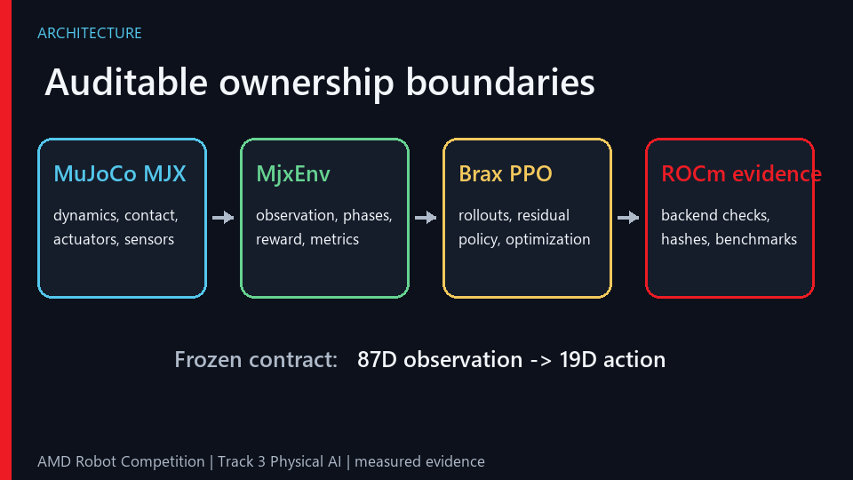
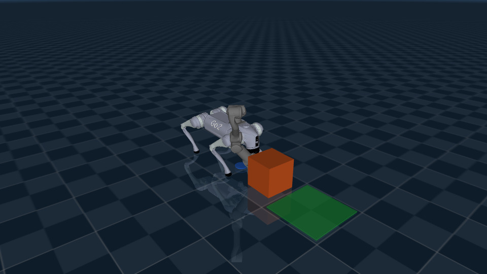
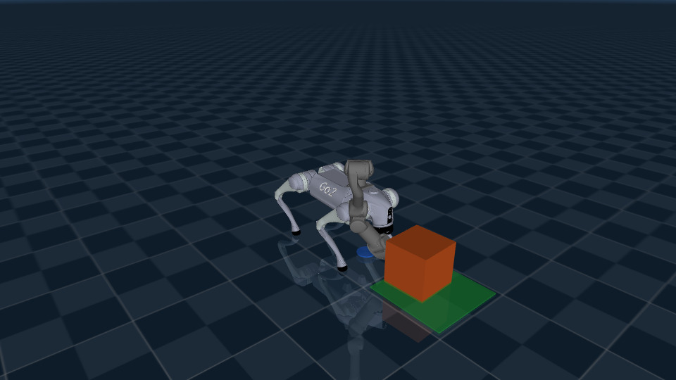
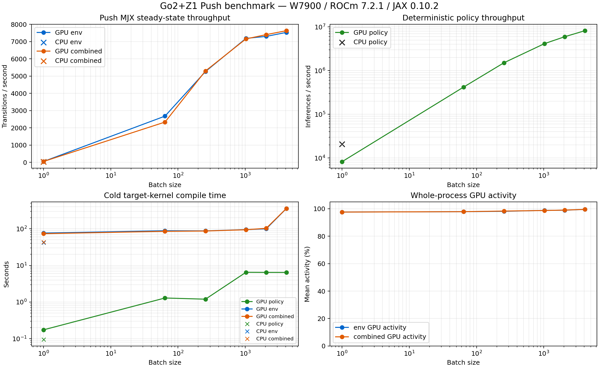

# ROCm-Accelerated Quadruped Mobile Manipulation with MJX

Technical report draft for AMD Robot Competition, Track 3: Physical AI.

## Executive summary

This project demonstrates a Go2 quadruped carrying a Z1 arm and gripper that
approaches a near-field box, aligns with it, pushes it into a goal zone, and
holds it there. The implementation uses MuJoCo MJX dynamics, a
MuJoCo Playground-style `MjxEnv`, Brax PPO, and a single Radeon PRO W7900
through ROCm. CUDA-only simulators and training stacks are not used.

The current fixed-box MVP preserved successful discrete outcomes in two
isolated fresh-process audits. It is not presented as a safety-certified or
randomized-placement controller. A separate +/-0.01 m randomized-box candidate
and the first closed-loop speed governor were both rejected. This report keeps
those limitations visible while documenting a reproducible successful rollout,
the valid single-environment evidence, and synchronized AMD GPU benchmarks.

## 1. Application definition

Warehouse and industrial floors are often obstructed by light packages,
containers, or tools. A mobile manipulator that can move an object to a marked
zone could clear an aisle or perform simple material repositioning without a
fixed workcell.

The scoped MVP is deliberately narrow:

- robot: Unitree Go2 base with Z1 arm and coupled gripper;
- task: fixed near-field box, flat ground, state-based simulation;
- sequence: `Approach -> Align -> Push -> Hold`;
- goal: box center within 0.08 m of the target for 100 control steps;
- control timestep: 0.01 s with five MJX physics substeps;
- action interface: 19 values at every stage (12 leg, 6 arm, 1 gripper).

The project does not claim perception, sim-to-real transfer, arbitrary box
placement, or collision-certified behavior.

## 2. System architecture

Four ownership boundaries keep the stack auditable:

1. MuJoCo/MJX owns the model, contacts, actuators, sensors, and physics state.
2. The task environment owns reset, observations, phases, rewards,
   termination, and metrics.
3. Brax owns PPO rollout collection and optimization, but not physics state.
4. Platform utilities own ROCm validation, system fingerprints,
   synchronization, checkpoint integrity, and benchmark fail-closed checks.

The task uses an 87-dimensional policy observation and a frozen
19-dimensional action. Cross-stage contracts are asserted in
`src/amd_robo/contracts.py` and CPU-safe tests. The selected policy and value
networks each use hidden layers `[512, 256, 128]`.

### Hybrid phase controller

The environment advances through four explicit phases. Approach, Align, and
Hold provide deterministic references. During Push, the Brax PPO policy
supplies a learned residual while the environment retains the same action
contract and safety metrics. This structure preserves physical contact
dynamics but reduces the exploration burden for a contact-rich whole-body
task.

## 3. Training data and procedure

No offline dataset, demonstration dataset, or camera dataset is used. Training
data consists of on-policy transitions generated by MJX from versioned YAML
configurations and explicit JAX PRNG keys.

The selected Push run used:

| Item | Value |
|---|---:|
| Algorithm | Brax PPO |
| Parallel environments | 16 |
| Training transitions | 73,728 |
| Episode length | 4,608 steps |
| Unroll length | 4 |
| PPO minibatches / updates | 1 / 2 |
| Learning rate | 0.00001 |
| Discount | 0.97 |
| Entropy cost | 0.01 |
| Policy/value networks | `[512, 256, 128]` |
| Compiled training scan | 1 host update |

The dense objective includes phase progress, command tracking, pose and
orientation terms, action and torque regularization, foot behavior, illegal
contact, object speed, object height, hold reward, and a success bonus. Raw
logs retain KL divergence, policy standard deviation, finite-state checks,
and per-episode task metrics.

The complete learner checkpoint design stores model parameters, optimizer
state, rollout state, and learner/environment PRNG keys. Restoring only model
weights is not treated as an exact training resume.

## 4. AMD GPU and ROCm implementation

The measured platform was:

- one Radeon PRO W7900, `gfx1100`, 48 GB VRAM;
- ROCm userspace 7.2.1;
- Python 3.12.3;
- JAX/JAXLIB and ROCm PJRT/plugin 0.10.2;
- MuJoCo/MJX 3.10.0 and Brax 0.14.2.

RGC Gate G0 verified all four layers on the AMD device: JAX identified the
ROCm GPU, batched MJX stayed finite, an official MuJoCo Playground environment
ran with `impl=jax`, and Brax PPO completed an update with checkpoint
save/reload.

### gfx1100 engineering boundary

On this RDNA3 stack, historical diagnostic runs showed that a large
reverse-mode XLA graph containing contact-dense `mjx.step`, non-constant reward,
and a fused Brax PPO scan could terminate during GPU compilation. CPU execution
and smaller GPU graphs established that the model, environment, reward, and PPO
base path were valid. A later controlled 20,480-step, scan-80 rerun completed in
123.317 seconds, so the historical compiler failure is not presented as a
deterministic upstream reproducer. The accepted ROCm-first guardrail remains a
host small-update loop with `training_scan=1`, complete training-state
persistence, and bounded physics substeps.

A separate, deterministic Brax issue was isolated: the initial PPO
`NamedSharding` uses a different mesh-axis name from its training `pmap`.
[Brax PR #674](https://github.com/google/brax/pull/674) makes the axes match,
and a W7900 test measured `same=True`; two host calls took 8.857824 seconds for
initial compilation and 0.004462 seconds for reuse. The submitted patch and
regression test are included in `patches/`. The Google CLA and automated change
check passed after the PR was opened on July 21, 2026; it is awaiting
maintainer review and is not claimed as accepted or merged.

## 5. Task evaluation

The selected policy was evaluated in two fresh processes with seed 777, one
environment, 4,608 control steps, solver iterations 16, and three exact repeats
per process.

| Metric | Process A | Fresh process B |
|---|---:|---:|
| Trained task success | 3/3 | 3/3 |
| Baseline task success | 0/3 | 0/3 |
| Trained maximum object speed | 0.441433 m/s | 0.383896 m/s |
| Baseline maximum object speed | 0.351248 m/s | 0.277368 m/s |
| Trained final goal distance | 0.079316 m | 0.074502 m |

Within-process traces were exact. Fresh-process continuous values diverged near
first object motion, but all discrete trained outcomes matched. The earlier
20-environment run that reported 20/20 success and one speed exceedance is now
diagnostic-only: repeated gfx1100 batches changed discrete outcomes. The
evaluator therefore fails closed for batched Push qualification.

An O2 speed governor reduced measured peaks to 0.223634-0.251639 m/s, but its
fresh-process trained A/B pair changed from success to a Push-phase failure.
The governor was rejected before training or randomized expansion. A
100-episode claim remains intentionally absent.

The +/-0.01 m randomized-box route was also rejected: its zero-residual
baseline succeeded in 10/16 episodes and violated both the speed and height
gates. The only frozen G2 candidate is therefore fixed near-field.

### Auditable representative rollout

One successful seed-pool member was rendered without frame removal. It entered
Approach, Align, Push, and Hold at steps 0, 1,335, 1,935, and 3,961, then
completed at step 4,060. Its final goal error was 0.079138 m, maximum object
speed was 0.305667 m/s, and object height stayed within
0.098568-0.105137 m. The MP4 contains all 813 sequential frames at 20 fps
(40.65 s) and decoded without errors.

The representative video is demo evidence, not a replacement for the isolated
fresh-process evaluation.

## 6. Measured ROCm performance

Each formal point ran in a fresh process. Reset compilation and cold
target-kernel compilation were timed separately, followed by at least ten
warmup steps and five synchronized repeats of 100 steps. All 21 GPU/CPU points
exited zero and returned finite values.

| Backend | Batch | Environment transitions/s | Policy + environment transitions/s |
|---|---:|---:|---:|
| CPU | 1 | 40.160 | 38.804 |
| GPU | 1 | 51.177 | 49.812 |
| GPU | 64 | 2,679.273 | 2,334.474 |
| GPU | 256 | 5,262.366 | 5,297.430 |
| GPU | 1,024 | 7,186.548 | 7,156.298 |
| GPU | 2,048 | 7,301.583 | 7,404.157 |
| GPU | 4,096 | 7,533.651 | 7,632.187 |

Batch 4,096 produced the highest steady-state throughput, but improved only
3.08% over batch 2,048 while combined cold compilation increased from
102.777 s to 358.407 s and peak sampled VRAM increased from 9,339 MB to
18,567 MB. Batch 1,024-2,048 is the practical iteration range.

Deterministic policy throughput scaled from 8,231 inferences/s at GPU batch
one to 8.20 million inferences/s at batch 4,096. CPU was faster for a single
small policy call; the Radeon GPU advantage appears through batched physical
simulation and inference.

The selected Push PPO run processed 73,728 transitions in 345.761 s:
213.234 transitions/s including cold compilation and 383.168 SPS in the final
reused host call. Final KL was 0.000192028 and minimum policy standard
deviation was 0.583383.

## 7. Innovation

The contribution is the integration and evidence discipline around a difficult
contact-rich AMD path:

- one physical model and one 19D action contract from standing through
  locomotion and manipulation;
- explicit phase ownership with a learned Push residual, avoiding a separate
  non-compliant training stack;
- a gfx1100-safe host small-update PPO loop with exact training-state resume;
- fail-closed ROCm benchmarks that reject wrong backends, non-finite output,
  mismatched commits, and incomplete telemetry;
- a rollout renderer that records seed selection, every frame, phase
  transitions, metrics, and artifact hashes;
- documented negative results instead of promoting the best-looking video as
  aggregate qualification.

## 8. Application value

The MVP is a foundation for aisle clearing and simple object repositioning.
The phase interface separates task planning from low-level contact execution,
so future work can replace fixed state inputs with perception and goal
selection without changing the 19D actuator contract. The measured batch
1,024-2,048 range also provides a concrete engineering target for large-scale
domain randomization once compiler stability and task safety improve.

Practical deployment still requires randomized layouts, obstacle avoidance,
better impact control, perception, system identification, hardware limits,
and a real-robot safety layer.

## 9. Reproducibility and deliverables

The reviewed source tree contains:

- MJX robot/task environments and the model assembly script;
- versioned standing, locomotion, and Push configurations;
- Brax host-loop and complete learner checkpoint utilities;
- preflight, evaluation, rollout-rendering, and ROCm benchmark scripts;
- CPU-safe contract tests;
- architecture, project rules, reproduction commands, licenses, and
  third-party notices.

Large checkpoints, raw benchmark logs, frame archives, and videos are kept
outside Git. The selected policy parameter SHA-256 is
`f033f9ff1ff23304b05ddeec9346d4f681ec5f4dbe265c5000804317916f9d0b`.
The unedited MP4 SHA-256 is
`eff34007a9781230485c79b6ca9355e0acc00e711d00eb2cd237154fecd8e799`.
Exact commands are in `docs/REPRODUCTION.md` and the repository README.

Project code is MIT licensed. External robot models and software are listed
in `THIRD_PARTY_NOTICES.md` and `assets/manifest.yaml`.

## 10. Limitations and open work

1. Fixed-box evidence is limited to isolated fresh-process audits; the old
   batched 20-environment result is diagnostic-only.
2. Randomized box placement is not qualified.
3. Evaluation is state-based and simulation-only.
4. A bounded-JIT, single-environment evaluator now makes the formal
   100-episode expansion practical, but its cross-validation and held-out
   matrix are not yet complete and no aggregate result is claimed here.
5. Large fused reverse-mode PPO graphs are not validated on this gfx1100
   software stack.
6. RGC did not expose the base image digest inside the instance.
7. Brax PR #674 is public, tested, and open without an upstream review.

These items are release gates, not hidden follow-up optimizations.

## 11. Team contribution record

This is a solo-developer entry credited to the verified public handle
`limengjin`. The contribution covers application scoping, robot/model assembly,
the Playground-style task environment, Brax PPO and ROCm integration,
evaluation and evidence tooling, benchmarking, documentation, and the public
Brax PR #674. The official competition profile must use the account owner's
registered identity; this report does not invent a different legal name.
